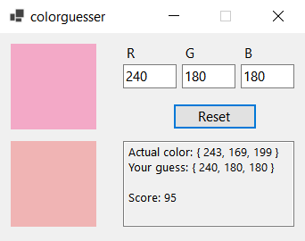

# colorguesser
Can you guess a color's RGB value?

Created in Visual Studio 2022 in C# with .NET Core 6.0.  
Inspired by a YouTube Short by Tom Lum: https://www.youtube.com/shorts/W4Rebo3aEkY

The executable is located in `bin/x86/Release/net6.0-windows/`